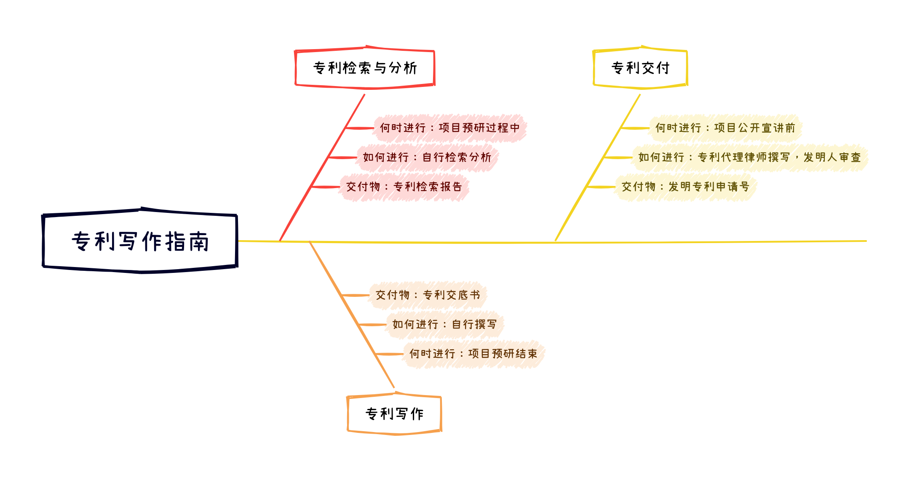
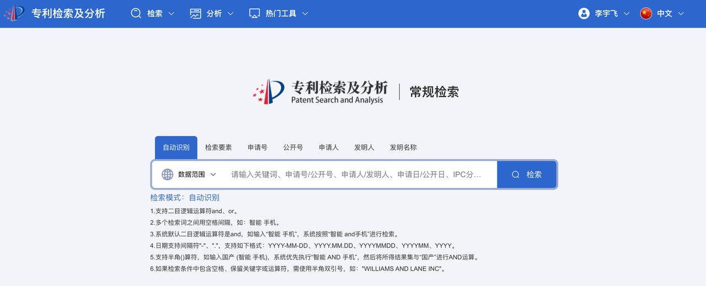
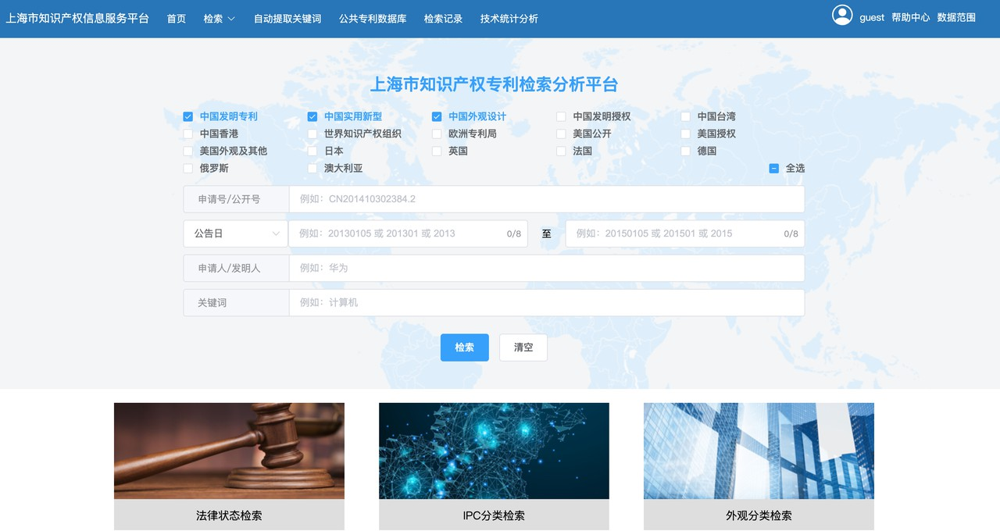

# 专利写作指南

本⽂档是⼀个⾯向中国研发团队的⼀份专利写作指南，⽤于帮助有志于成为专利发明⼈的⼩伙伴撰写⾃⼰的第⼀份专利。

目前只有中国专利部分，如何将中国专利，注册到美国、欧洲、日本等国家，欢迎大家一起来编辑。

## 全流程指南

⼀件专利的全流程时间估计：

| 事务         | 阶段               | 时间         |
| ------------ | ------------------ | ------------ |
| 专利创作期   | 专利检索与分析     | 1-4 周       |
|              | 专利写作           | 1-4 周       |
|              | 代理撰写⽂书       | 1-4 周       |
|              | 审查和修改专利⽂书 | 0-4 周       |
| ⼩计         |                    | 3-16 周      |
| 国知局审查期 | 申请和受理         | 1 周内       |
|              | 初审+公开          | 3-18 个月    |
|              | 实质审查           | 6-18 个⽉    |
|              | 专利授权           | 2 个⽉       |
| 总计         |                    | 11 - 38 个月 |

## 什么时候开始专利写作？

⼀个典型的误区是，认为专利是对现有项⽬实施的总结，因此总要等项⽬代码写完之后才开始写专利。⽽在专利实务中，发明专利是⼀种保护性专利，通常作为软件开发预研阶段的交付物产⽣。例如，苹果公司每进⼊⼀个新赛道前，相关的团队⾸先会展开预研，提交申请并公开⼤量专利，以确保实际⽣产实施过程中没有专利⻛险。

主要有以下⼏个注意事项：

1. 专利检索与分析应随项⽬预研⼀同进⾏。为了使⾃研项⽬绕开竞争对⼿的专利封锁，我们往往在预研阶段就要开始进⾏专利检索与分析。除专利检索外，常⽤的专利竞争技巧还包括：选取合适开源协议的开源项⽬，基于较新的替代性技术进⾏研发等等。
2. 专利写作应随着预研结束⽽完成。专利保护想法⽽不保护实现，因此专利申请宜早不宜迟。⼀个典型的案例是：同⼀个技术⽅向在⾏业内有多个团队在进⾏，某⼀个团队先⾏申请了专利，导致其它⼏个技术团队的路线被封锁。
3. 专利应在项⽬宣发之前交付。专利的通过与否，依赖国知局评定的专利三性，分别是存在时间性、授权地域性、权利的独占性。⼀个典型的案例是：某企业在申请专利前，对外发布了⼀篇宣传⽂章来宣传该项⽬，因此国知局认定该项⽬违反了专利三性，不予通过。

综上所述，⼀个较为推荐的专利研发路线是：在项⽬预研过程中进⾏专利检索和分析，出具检索报告，预研结束时交付专利交底书，在对外公开宣讲前，由代理提交专利并拿到专利申请号。专利申请，宜早不宜迟，只争朝夕。

# 专利检索与分析

专利检索和分析是关乎专利是否通过实质审查的重要⼯作。

* 专利检索是指：在相关的平台上，搜索与当前撰写专利相近的专利、⽂献和⽹络公开内容等。
* 专利分析是指：对⽐检索到的材料中所提及的内容，是否已经覆盖了当前所撰写专利的技术要点，并给出结论。即当前专利与检索到的专利相⽐，有哪些优势或改进点。

通过专利检索和分析，可以帮助发明⼈明确专利三性，极⼤提⾼专利的通过率。

## 专利检索平台推荐

### 国知局

https://pss-system.cponline.cnipa.gov.cn/conventionalSearch

需要使⽤身份证，以⾃然⼈身份注册

### 上海知产服务平台

[https://www.shanghaiip.cn/search/#/home](https://www.shanghaiip.cn/search/%23/home)

免登录

# 专利写作

## 专利交底书

专利交底书是由发明⼈撰写，发送给专利代理律师的参考⽂档。专利代理律师会基于该⽂件内容，撰写专利⽂书。

每⼀个代理⽅都有⾃⼰的交底书格式，点击下方链接，可以下载一个公开的交底书模版示例。

[中国科学技术大学：专利交底书模版](https://iat.ustc.edu.cn/u/cms/xjjs/202203/29084743bh3k.doc)

## 专利写作的要点

专利交底书的写作⽬的是，让专利代理律师能够理解该专利，并体现出专利相对于背景技术的优势所在。

1. 多画图，⼀图胜千⾔，围绕图形可以降低专利代理⽼师的写作难度。
2. 多举例，对于复杂度较⾼的专利，⼀个好的例⼦可以同时让专利代理和审查员看懂，以防有价值的专利明珠蒙尘。
3. 写好专利的优势很重要，⼀定要具有极强的说服⼒，多花些⼼思潜⼼思考。

## 专利自检索报告

专利自检索报告是由发明⼈撰写，⽤于检查专利是否有被封锁的风险。专利检索报告有两个重要的作用：

1. 在检索过程中，帮助发明人理清自身的专利撰写思路，从而提高专利的质量。
2. 发明人作为最理解专利的人，通过澄清和相关背景技术的关联和差异，可以帮助专利代理律师了解专利的三性，从而提高专利的通过率。

下面是一个典型的自检索报告样例：

[知识产权发明人自检索报告](./guide/发明人自检索报告.docx)

# 专利交付

不同的公司，以及不同的专利代理，所制订的专利交付流程都不尽相同。

这里介绍⼀个典型的专利交付流程。

## 提交文件和修改

以一个简单的例子来说明专利交付的流程。

* 发明人需要提交的文件：
    * 交底书
    * 专利自检索报告（可选）
* 提交文件的命名规范：
    * 交底书：以专利名称命名即可。例如 `xxx.docx`。
    * 代理返回的专利稿件：以专利名称+版本命名。例如 `xxx-v1.docx`。
    * 返回给代理的专利修改建议：以专利名称+版本+后缀命名。例如 `xxx-v1-修改版.docx`。
* 修改方式：
    * 使用 Word 审阅功能进行批注和修改。

## 获取回执

专利代理递交专利至国知局后，专利代理或本研究机构的专利工作者，返回一封专利受理通知给申请人，样例如下：

    Dear all,

    专利已受理。
    
    专利申请号：CN202110000000.0
    发明专利名称：一种基于xxx的xxx
    发明人：xxx,yyy
    申请人：xxx
    受理时间：2021-03-01

    请查收专利受理通知书，如有问题请及时与我联系。

一封正式的回执是非常必要的，因为研发团队往往需要在递交正式专利申请后，进行宣发和信息披露。如果没有回执，就无法证明该专利已经递交，从而导致宣发过程中的专利三性问题。

# 总结

专利写作是项⽬预研阶段的⼀个关键产出，可以帮助我们构建项⽬的护城河，提⾼企业的核⼼竞争⼒。

专利写作的⼏个要点：有想法就写，宜早不宜迟；先写专利，再宣发；检索分析、提交交底书、和代理律师改稿，三个步骤记在⼼。

开始书写你的第⼀件专利吧。
